# Global COVID-19 Pandemic Analysis Report
**Author**: Data Science System
**Date**: May 2026
**Data Source**: Our World in Data (Archived up to Aug 2024)

---

## 1. Executive Summary
The COVID-19 pandemic, caused by the SARS-CoV-2 virus, has been the most significant global health crisis of the 21st century. This report provides a data-driven retrospective analysis of the pandemic's progression, its devastating impact on global health and economies, and the transformative effect of the global vaccination campaign.

## 2. Introduction: The Cause and Origins
COVID-19 is an infectious disease caused by the SARS-CoV-2 virus. While the exact zoonotic origin remains a subject of scientific study, the initial spread was identified in Wuhan, China, in late 2019. The virus is primarily transmitted through respiratory droplets, leading to a rapid global spread due to human mobility and the asymptomatic nature of many cases.

## 3. Global Spread: Timeline of Transmission
The virus spread with unprecedented speed, reaching nearly every country within months.

### 3.1 Total Growth
The following graphs illustrate the exponential growth of total cases and deaths globally.

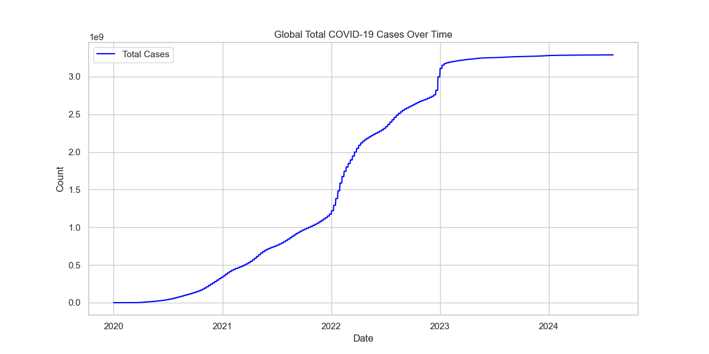
*Figure 1: Exponential growth of cumulative COVID-19 cases.*

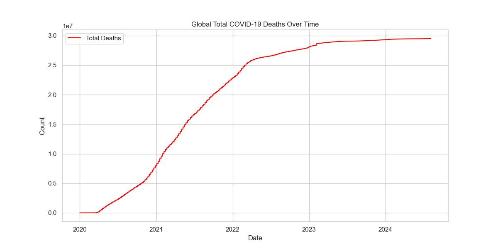
*Figure 2: Cumulative deaths showing the heavy toll of the pandemic.*

### 3.2 Daily New Cases and Deaths
The daily fluctuations show distinct waves, reflecting the emergence of new variants (Alpha, Delta, Omicron) and the implementation/easing of lockdowns.

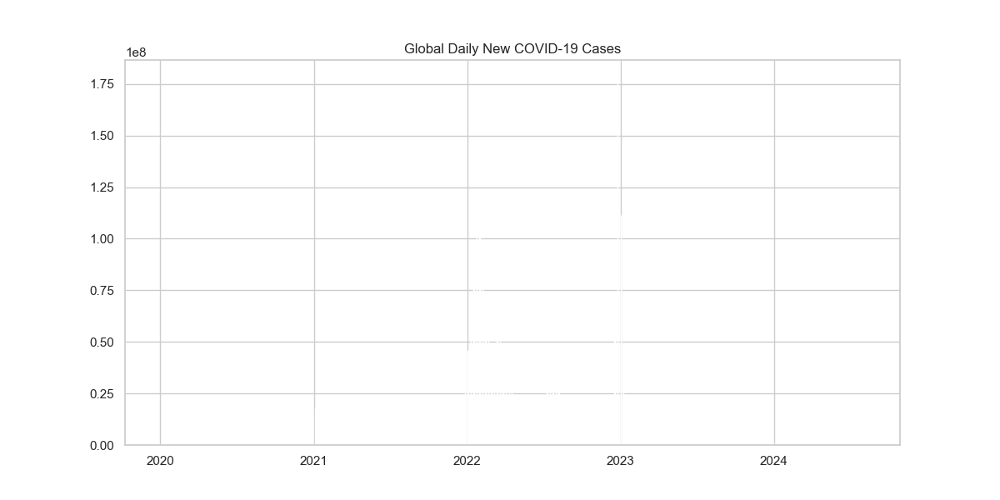
*Figure 3: Global daily new cases highlighting the various "waves" of the pandemic.*

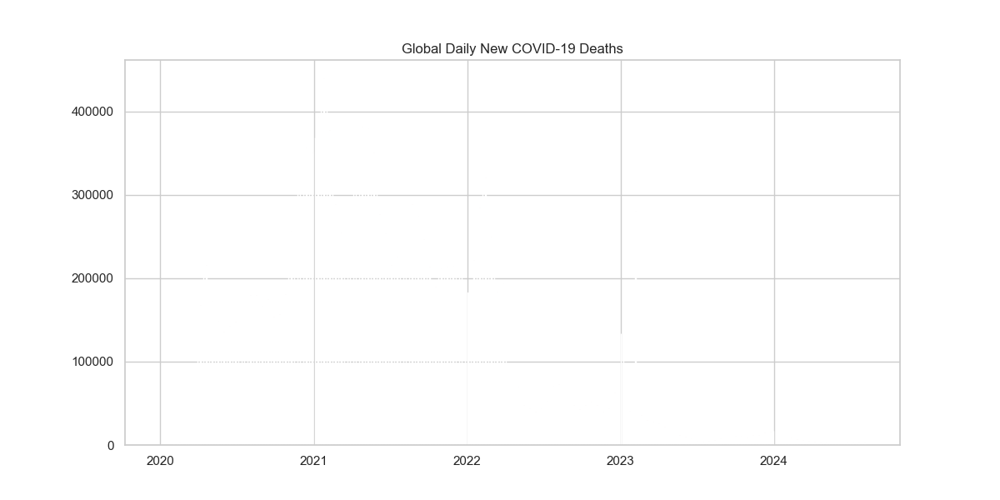
*Figure 4: Daily new deaths often lagged behind cases but showed significant peaks during major waves.*

## 4. The Burden of Suffering: Mortality and Hospitalization
Suffering was not uniform across the globe. Some countries faced significantly higher mortality rates.

### 4.1 Most Affected Nations
The United States, India, and Brazil reported the highest total numbers of cases and deaths.

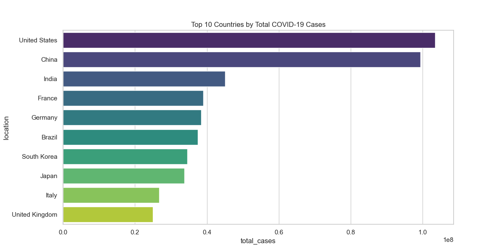
*Figure 5: Nations with the highest cumulative case counts.*

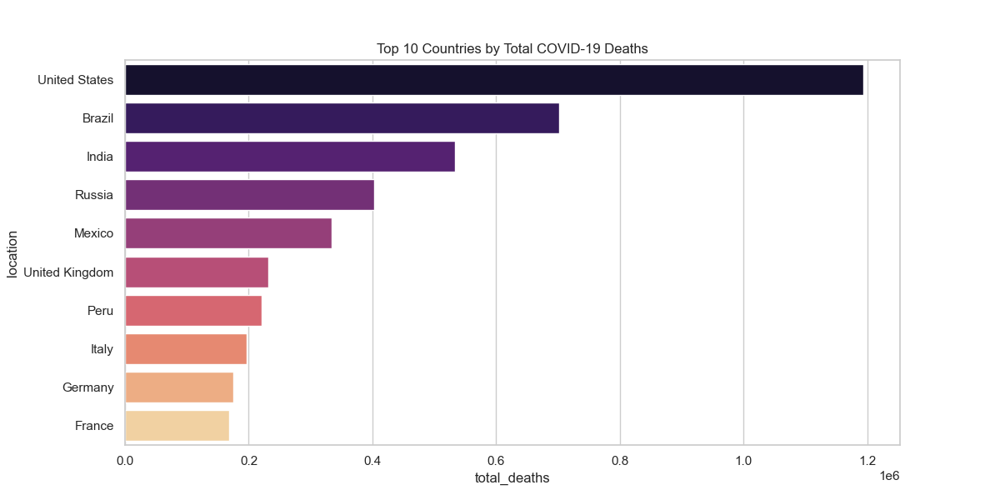
*Figure 6: Nations with the highest cumulative death counts.*

### 4.2 Case Fatality Rate (CFR)
CFR represents the percentage of confirmed cases that resulted in death. High CFR often indicates overwhelmed healthcare systems or older populations.

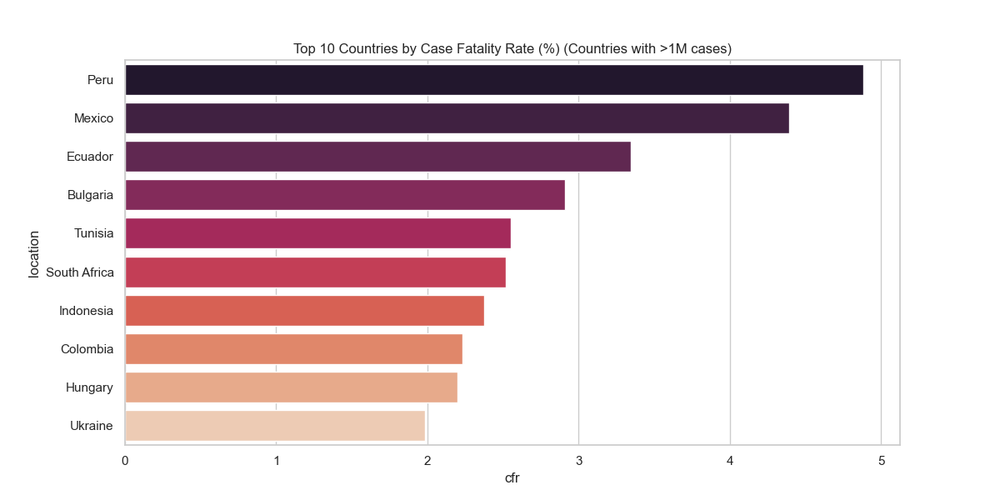
*Figure 7: Countries with the highest CFR among those with significant case counts.*

### 4.3 Hospitalization and ICU Trends
Using the United States as a representative case, we can see the strain on healthcare infrastructure during peak periods.

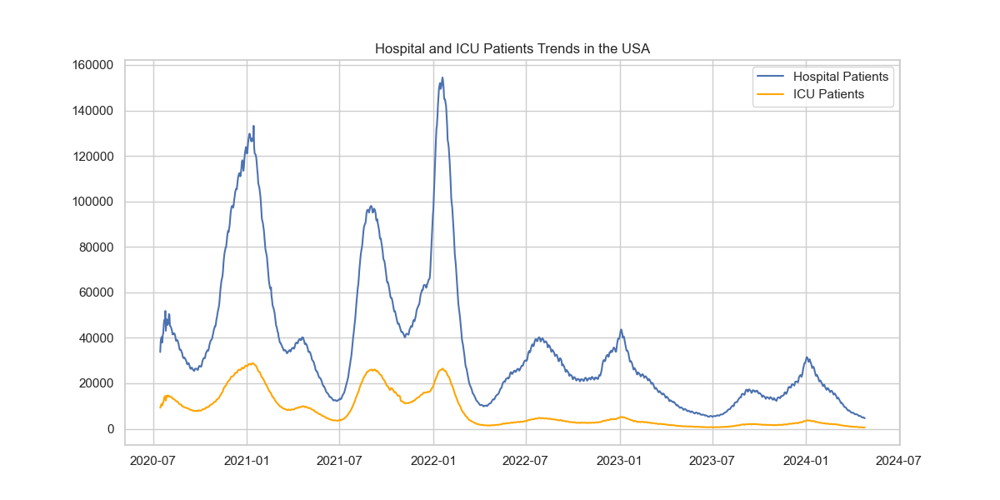
*Figure 8: ICU and Hospitalization trends showing the immense pressure on health systems.*

## 5. Socio-Economic and Demographic Factors
The impact of COVID-19 was deeply influenced by the pre-existing conditions of each nation.

### 5.1 Wealth and Mortality
Contrary to some expectations, wealthier nations often reported higher mortality per million, partly due to better reporting, older populations, and higher international connectivity.

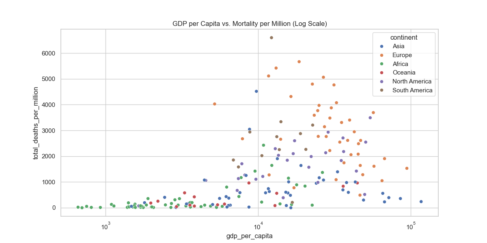
*Figure 9: Relationship between GDP per capita and mortality rates.*

### 5.2 The Role of Age
Older populations were significantly more vulnerable to severe outcomes and death.

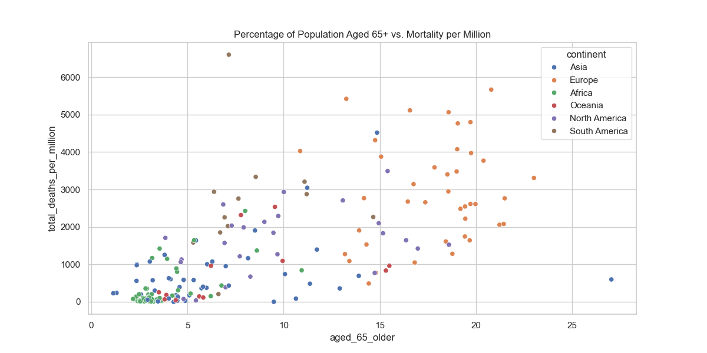
*Figure 10: Higher proportions of citizens aged 65+ strongly correlate with higher mortality.*

### 5.3 Government Response
Government restrictions (Stringency Index) were crucial in "flattening the curve." The following shows the relationship in India.

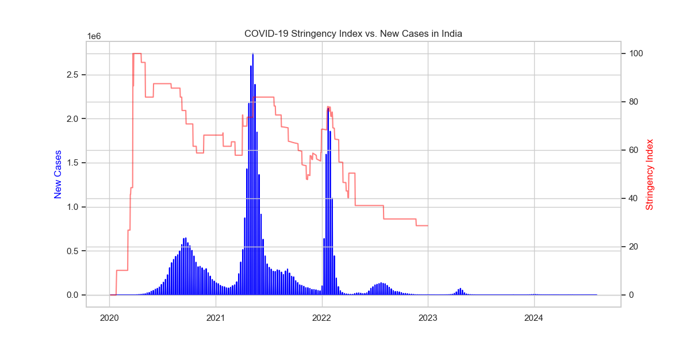
*Figure 11: Impact of restrictions on new case growth in India.*

## 6. The Turning Point: Vaccination Effects
The development and rollout of vaccines marked the beginning of the end of the acute phase of the pandemic.

### 6.1 Global Rollout
Vaccination efforts reached billions of people in record time.

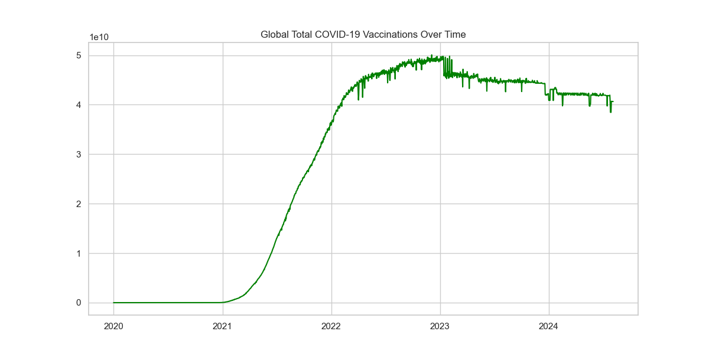
*Figure 12: Global vaccination progress.*

### 6.2 Effectiveness Analysis
Data shows a clear correlation: countries with higher vaccination rates generally saw lower mortality per million as the pandemic progressed.

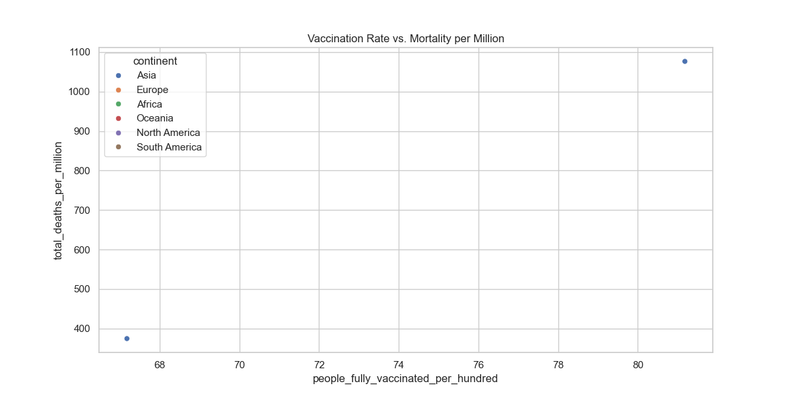
*Figure 13: Correlation between vaccination coverage and death rates.*

## 7. Global Outcomes and Regional Comparisons
The pandemic's outcome varied by continent, with Europe and the Americas bearing the highest reported death tolls.

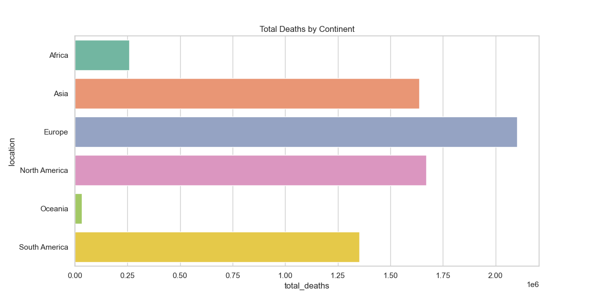
*Figure 14: Total deaths across major world regions.*

### 7.1 Testing and Positivity
Testing density was a key factor in identifying and controlling the spread.

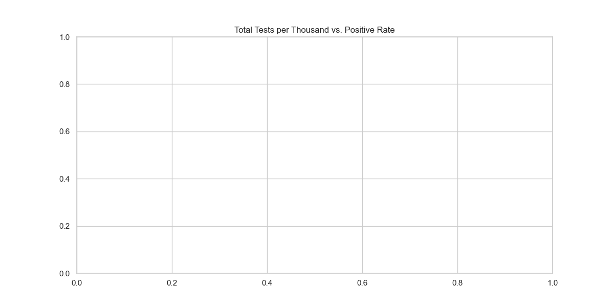
*Figure 15: Relationship between testing volume and the rate of positive results.*

### 7.2 Health and Longevity
Nations with higher life expectancy often had more vulnerable elderly populations, leading to a complex relationship with mortality.

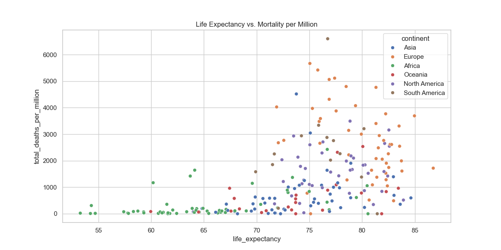
*Figure 16: Life expectancy across nations compared to COVID-19 mortality.*

## 8. Conclusion
The COVID-19 pandemic reshaped global healthcare, policy, and society. Key findings include:
- **Exponential Spread**: The virus's ability to spread globally within months overwhelmed even robust health systems.
- **Demographic Vulnerability**: Age was the single most significant predictor of mortality.
- **Vaccine Success**: While vaccines did not entirely stop transmission, they drastically reduced the severity of outcomes and the risk of death.
- **Systemic Strain**: The "suffering" was not just in deaths, but in the near-collapse of healthcare infrastructure (ICU/Hospitalizations).

This analysis underscores the importance of global cooperation, rapid data sharing, and robust public health infrastructure in managing future biological threats.

---
*End of Report*
